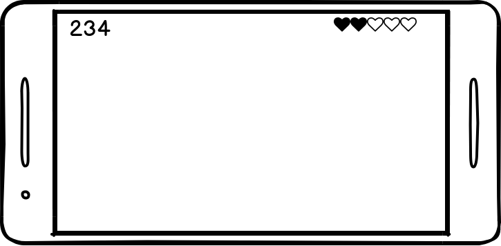
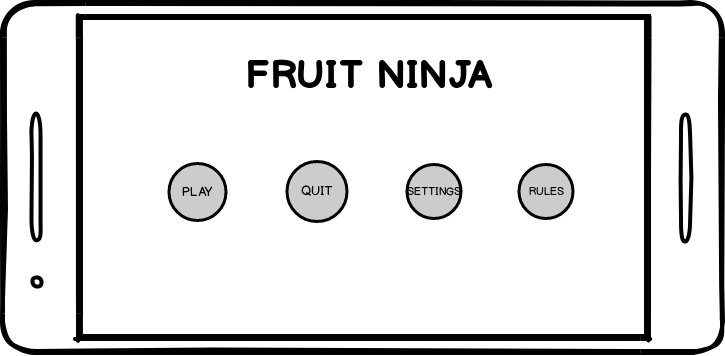
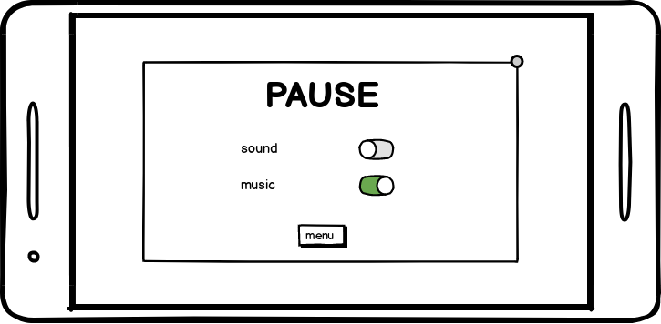
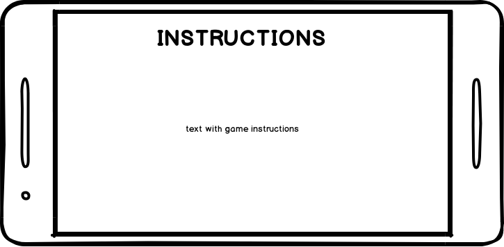

# LPOO1718_T3_G10

João Carlos Parada Alves up201605236 up201605236@fe.up.pt
Carlos Daniel Coelho Ferreira Gomes up201603404 up201603404@fe.up.pt

Mock-ups

UML - classes

Testes a serem implementados:

Principais funcionalidades: 
O objetivo do jogo é obter o maior número de pontos curtando frutas com o deslizar do dedo no ecrã. Quantas mais frutas curtar mais pontos ganha. O jogo acaba se curtar uma bomba ou então se deixar escapar do ecrã mais de 5 frutas sem estas estarem curtadas. 
O jogo possuirá som e musica a qual poderá ser desligada tanto no menu de pausa do jogo como no menu de configurações acessível apartir do menu principal. Como se percebeu, o jogo está vai ser desenvolvido para Android e usando box2d da libgdx.

